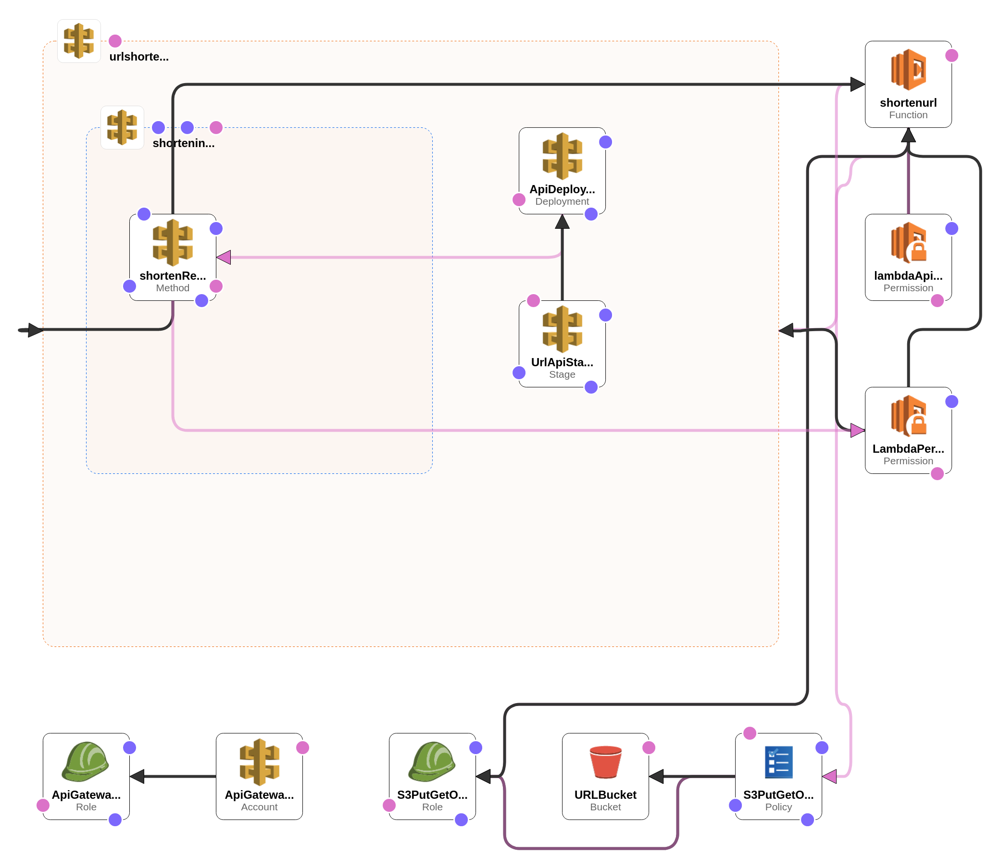

## Description:

This is a URL Shortener using multiple AWS Services (S3, Lambda, API Gateway).

Links are send as parameters of GET requests to API Gateway.\
The API Gateway uses Lambda Proxy to forward the request to Lambda.\
The Lambda Function creates a unique ID, a .html file in a S3 Bucket and return the url of the file.\
The S3 Bucket allows public-read access for all documents.

You can find a live version here: [https://cwoellner.com/urlshortener/](https://cwoellner.com/urlshortener/)

## Cloudformation Template:

Creates the Bucket with Lifecycle Policy and Website hosting enabled.\
Creates the Lambda function and the reqired AIM role and policy for accesing the bucket.\
Creates the API, connects it with the the Lambda function via Lambda Proxy, adds the required AMI roles and policies and deploys the API.\

#### TODO:
  - Add CORS for API Gateway
  - Throttle API Gateway
  - Find a way to upload the lambda code within the template

The live version has these issues are fixed via manual intervention.

## Sources:

[https://blog.jayway.com/2016/08/17/introduction-to-cloudformation-for-api-gateway/](https://blog.jayway.com/2016/08/17/introduction-to-cloudformation-for-api-gateway/)

[https://medium.com/@joanisaac.biel/setting-up-cors-and-lambda-proxy-integration-in-aws-api-gateway-using-cloudformation-371312eebcb0](https://medium.com/@joanisaac.biel/setting-up-cors-and-lambda-proxy-integration-in-aws-api-gateway-using-cloudformation-371312eebcb0)
